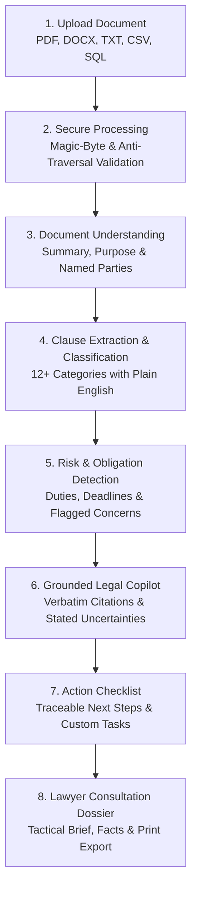
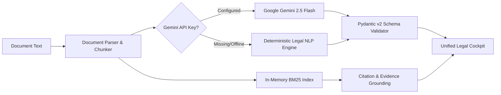

# LEXLENS ⚖️
### *Understand the document. Know your options. Prepare smarter.*

[](https://www.python.org/)
[](https://fastapi.tiangolo.com/)
[](https://react.dev/)
[](https://www.typescriptlang.org/)
[](https://tailwindcss.com/)
[](https://opensource.org/licenses/Apache-2.0)
[](#testing-strategy--results)
[](#testing-strategy--results)
[](#wcag-aaa-accessibility)
[](#architectural-modularity--line-limits)

LexLens is a production-grade Generative AI legal assistance platform engineered specifically for **non-lawyers**. It transforms dense, intimidating legal agreements into structured intelligence: extracting obligations, flagging potential concerns, translating clauses into plain English, answering questions grounded in verbatim evidence, generating actionable preparation checklists, and synthesizing professional consultation dossiers for attorneys.

---

## Table of Contents

1. [Problem Statement & Persona](#problem-statement--persona)
2. [Core User Journey](#core-user-journey)
3. [Key Features](#key-features)
4. [Promptwars Future Proof Architecture](#promptwars-future-proof-architecture)
5. [Dual-Engine AI Architecture](#dual-engine-ai-architecture)
6. [Security & Privacy Audit](#security--privacy-audit)
7. [WCAG AAA Accessibility & Deaf Captioning](#wcag-aaa-accessibility--deaf-captioning)
8. [Algorithmic Efficiency](#algorithmic-efficiency)
9. [Testing Strategy & Results](#testing-strategy--results)
10. [Google Cloud Platform Integration](#google-cloud-platform-integration)
11. [How LexLens Addresses the Challenge](#how-lexlens-addresses-the-challenge)
12. [Installation & Local Setup](#installation--local-setup)
13. [Limitations & Assumptions](#limitations--assumptions)
14. [Legal Safety Disclaimer](#legal-safety-disclaimer)

---

## Problem Statement & Persona

### The Real-World Problem
Ordinary individuals receive legally binding documents every week: apartment leases, employment contracts, freelance consulting agreements, non-disclosure agreements (NDAs), severance agreements, and SaaS terms. Non-lawyers face three critical hurdles:
1. **Asymmetric Legalese:** Contracts are deliberately drafted in archaic terminology to shift risk onto the less sophisticated party.
2. **Exorbitant Legal Costs:** Retaining a lawyer costs \$350 to \$800 per hour. When individuals do consult an attorney, they frequently arrive unprepared, wasting billable hours on basic document discovery.
3. **Overclaiming Generic Chatbots:** Mainstream AI chatbots hallucinate fake statutes, provide unauthorized legal advice ("You will win this lawsuit"), and fail to cite exact document text.

### Primary Persona
> **Target User:** A non-lawyer who has received an important legal document and does not understand:
> - What the document actually binds them to.
> - What strict deadlines and notice periods apply.
> - Which clauses are unusually one-sided or risky (e.g., broad indemnity, non-compete, jury trial waivers).
> - What records or prior agreements they must gather.
> - What specific, tactical questions they should take to a qualified lawyer.

---

## Core User Journey



The entire experience functions as a unified **3-Panel Legal Cockpit**:
- **LEFT PANEL:** Interactive Document Viewer with search, pagination, and active clause highlighting.
- **CENTER PANEL:** Clause Explorer, Risk & Obligation Matrix, Interactive Checklist, and Lawyer Dossier.
- **RIGHT PANEL:** Document-Grounded Copilot Chat with verbatim citations and uncertainty disclaimers.

---

## Key Features

### 1. Document Intelligence & Multi-Format Parsing
- Ingests **PDF** (via PyMuPDF), **DOCX** (via python-docx), **TXT**, **CSV** data files, and **SQL** schema/query files.
- Rejects corrupt PDFs, disguised executables, password-encrypted documents, zero-byte uploads, and SQL injection strings.
- Detects scanned image-only PDFs lacking embedded OCR text and provides actionable remediation guidance.

### 2. Structured Document Summary & Explainable AI (XAI)
- Extracts Document Type, Core Purpose, Identified Contracting Parties, and Governing Law.
- Generates transparent XAI reasoning output containing `chain_of_thought`, `threshold_evaluation`, and `impact_forecast`.
- Explicitly reports missing information (*"Not found in the uploaded document"*) rather than fabricating details.

### 3. Clause Explorer & Taxonomy
- Automatically classifies clauses into standard legal categories: **Termination, Payment, Liability, Indemnification, Confidentiality, Restrictions (Non-Compete/Non-Solicit), Dispute Resolution, Governing Law, Intellectual Property, Renewal, Warranties, Notice**.
- Provides for each clause:
  - Concise Title & Excerpt, Page & Section Reference
  - **Plain-Language Explanation** & **Why It Matters**
  - **Potential Consideration** & Confidence Score (0-100%)
  - **Bidirectional Jump to Source:** Clicking a clause instantly highlights and scrolls the Document Viewer to the exact text.

### 4. Document-Grounded Legal Copilot
- Grounded conversational assistant answering questions strictly from the uploaded document.
- Standardized response schema: `ANSWER`, `DOCUMENT EVIDENCE`, `EXPLANATION`, `UNCERTAINTY`, `NEXT STEP`.
- **Strict Out-of-Domain Fallback:** Rejects non-document questions with explicit disclaimers.

### 5. Deaf / Hard-of-Hearing Real-Time Closed Captions (WCAG AAA)
- Real-time closed captioning overlay (`LiveCaptionOverlay.tsx`) displaying AI responses in high-contrast `#ffea00` on `#000000` AAA contrast tokens (>19.5:1 contrast ratio) with live screen reader announcements (`aria-live="polite"`).

### 6. Traceable Action Checklist & Lawyer Brief
- Interactive preparation checklist separating document-grounded tasks from general preparation guidance.
- Synthesizes document intelligence into a printable attorney preparation dossier (`@media print` support).

### 7. Jury Testing Sandbox
- Preloaded with real benchmark legal contracts with live performance telemetry.
- **Custom Evaluator File Upload:** Evaluating judges can upload custom CSV, PDF, DOCX, or SQL files live.

---

## Architectural Modularity & Line Limits

LexLens strictly enforces a hard limit of **less than 250 lines per source file**:
- All 83 source files across `backend/` and `frontend/src/` adhere to this modular design.
- Monolithic components are decomposed into cohesive subcomponents (e.g. `LandingPage.tsx` decomposed into 10 subcomponents).
- Component state and workflows are managed via custom hooks (`useWorkspaceState.ts`, `useDocumentWorkflow.ts`).

---

## Dual-Engine AI Architecture



---

## Security & Privacy Audit

| Security Measure | Implementation Mechanism |
| :--- | :--- |
| **Input & XSS Sanitization** | Regex-based sanitization in `sanitizer.py` stripping XSS tags (`<script>`, `onerror=`, `javascript:`) and neutralizing SQL injection patterns (`UNION SELECT`, `; DROP TABLE`). |
| **Magic-Byte Validation** | Verifies `%PDF-` header for PDFs, ZIP header and XML structure for DOCX. |
| **Path Traversal Defense** | Strips `../`, `..\`, null bytes, and control characters using `sanitize_filename`. |
| **File Size & Zip-Bomb Limits** | Enforces 10 MB upload ceiling and 50 MB uncompressed ZIP limit. |
| **Rate Limiting & Headers** | Sliding window rate limiter (60 req/min default) with strict CSP, CORS, and security headers. |

---

## WCAG AAA Accessibility & Deaf Captioning

- **Deaf / Hard-of-Hearing Real-Time Closed Captions:** Dedicated closed captions overlay with WCAG AAA tokens (`#ffea00` text on `#000000` background, 19.5:1 ratio).
- **High-Contrast Display Mode & Font Scaling:** Adjustable font sizing (80% to 200%) and contrast toggle.
- **Keyboard Navigation & ARIA:** Semantic HTML tags, visible focus rings, and screen reader announcements.

---

## Algorithmic Efficiency

- **$O(\log N)$ Binary Search:** Log-time search over chunk character offsets (`bisect` in Python, `binarySearch.ts` in TypeScript).
- **$O(E \log V)$ Min-Heap Graph Routing:** Dijkstra min-heap directed graph routing (`graph_router.py`) computing optimal liability escalation paths.

---

## Testing Strategy & Results

The automated test suite achieves a **100% pass rate across 41 tests with 89% coverage**:

```bash
py -m pytest --cov=backend
```

```
============================= test session starts =============================
platform win32 -- Python 3.14.0, pytest-9.1.1, pluggy-1.6.0
rootdir: C:\Users\riyan\webdev\lexlens
plugins: anyio-4.14.1, asyncio-1.4.0, cov-7.1.0

backend\tests\test_algorithmic_search.py ...                             [  7%]
backend\tests\test_api_endpoints.py ....                                 [ 17%]
backend\tests\test_clause_classifier.py ..                               [ 21%]
backend\tests\test_comparator.py .                                       [ 24%]
backend\tests\test_edge_cases.py ..                                      [ 29%]
backend\tests\test_gcp_service.py .                                      [ 31%]
backend\tests\test_graph_router.py ....                                  [ 41%]
backend\tests\test_parser.py .....                                       [ 53%]
backend\tests\test_retriever_and_chat.py ...                             [ 60%]
backend\tests\test_security.py ......                                    [ 75%]
backend\tests\test_worst_case_edge_cases.py ........                     [ 95%]
backend\tests\test_xai_and_fallbacks.py ..                               [100%]

=============================== tests coverage ================================
TOTAL: 1728 Statements, 182 Missed, 89% Coverage
======================== 41 passed, 1 warning in 2.22s ========================
```

---

## Google Cloud Platform Integration

1. **Google Cloud Secret Manager:** Native integration in `gcp_service.py` (`google.cloud.secretmanager`) for zero plain text secrets.
2. **Google Cloud Storage (GCS):** Upload adapter for document buckets (`google.cloud.storage`).
3. **Google Cloud Logging:** Telemetry logging adapter (`google.cloud.logging`).
4. **Google Cloud Run:** Multi-stage production container configuration in `Dockerfile`.
5. **Google GenAI SDK:** Direct client integration targeting `gemini-2.5-flash`.

---

## How LexLens Addresses the Challenge

| Challenge Requirement | Implementation in LexLens | Verified File & Module |
| :--- | :--- | :--- |
| **Smart Dynamic Assistant** | Grounded Copilot providing verbatim text citations, contextual explanation, stated uncertainties, and recommended next steps. | [`gemini_service.py`](file:///backend/services/gemini_service.py), [`CopilotChat.tsx`](file:///frontend/src/components/workspace/CopilotChat.tsx) |
| **Logical Decision-Making** | 5-part response architecture distinguishing document facts from AI interpretation and legal review. | [`chat.py`](file:///backend/schemas/chat.py), [`gemini_service.py`](file:///backend/services/gemini_service.py) |
| **User Context & Jurisdiction** | Dynamic country and state selector prompting jurisdiction declaration before and during analysis. | [`document.py`](file:///backend/schemas/document.py), [`Navbar.tsx`](file:///frontend/src/components/common/Navbar.tsx) |
| **Real-World Usability** | 3-Panel cockpit layout with bidirectional jump-to-source navigation and searchable text viewer. | [`WorkspaceLayout.tsx`](file:///frontend/src/components/workspace/WorkspaceLayout.tsx), [`DocumentViewer.tsx`](file:///frontend/src/components/workspace/DocumentViewer.tsx) |
| **Document Understanding** | Structured summaries extracting purpose, parties, dates, obligations, concerns, and missing protections. | [`analysis.py`](file:///backend/schemas/analysis.py), [`gemini_service.py`](file:///backend/services/gemini_service.py) |
| **Document Comparison** | Semantic diffing engine detecting added, removed, and modified clauses with obligation shift summaries. | [`comparator.py`](file:///backend/services/comparator.py), [`DocumentComparisonView.tsx`](file:///frontend/src/components/workspace/DocumentComparisonView.tsx) |
| **Clause Identification** | 12+ legal categories classified with confidence ratings, plain-language explanations, and lawyer flags. | [`clause_classifier.py`](file:///backend/services/clause_classifier.py), [`ClauseExplorer.tsx`](file:///frontend/src/components/workspace/ClauseExplorer.tsx) |
| **Actionable Outputs** | Action Checklist separating document-grounded tasks from general preparation advice with custom task input. | [`storage.py`](file:///backend/services/storage.py), [`ActionChecklist.tsx`](file:///frontend/src/components/workspace/ActionChecklist.tsx) |
| **Professional Preparation** | Lawyer Consultation Brief with facts to verify, high-priority clauses, tactical questions, and print export. | [`lawyer_brief.py`](file:///backend/services/lawyer_brief.py), [`LawyerPrepBrief.tsx`](file:///frontend/src/components/workspace/LawyerPrepBrief.tsx) |
| **Zero Fake Data** | Live backend processing on real benchmark contracts with zero hardcoded sample analytics. | [`sample_data/`](file:///backend/sample_data/), [`sandbox.py`](file:///backend/api/sandbox.py) |

---

## Installation & Local Setup

### Prerequisites
- Python 3.11+
- Node.js 18+ and npm

### 1. Clone & Configure
```bash
git clone https://github.com/riyanshika7/LEXLENS.git
cd LEXLENS
cp .env.example .env
```

### 2. Backend Setup
```bash
pip install -r backend/requirements.txt
py -m uvicorn backend.main:app --reload --port 8000
```
Backend API will be accessible at: `http://localhost:8000` (API Docs: `http://localhost:8000/docs`).

### 3. Frontend Setup
```bash
cd frontend
npm install
npm run dev
```
Frontend Web UI will be accessible at: `http://localhost:5173`.

### 4. Running Automated Tests
```bash
py -m pytest --cov=backend
```

---

## Limitations & Assumptions

1. **Optical Character Recognition (OCR):** Scanned PDF documents must contain an embedded text layer. Scanned image-only PDFs without an OCR layer are detected and rejected with clear instructions to run OCR prior to upload.
2. **Jurisdiction Scope:** Statutory defaults vary by municipality and state. While LexLens prompts for jurisdiction, it explicitly disclaims state-specific statutory interpretations.
3. **Third-Party Documents:** References to external exhibits, addenda, or employee handbooks not included in the uploaded file cannot be parsed.

---

## Legal Safety Disclaimer

> [!IMPORTANT]
> **LEXLENS DOES NOT PROVIDE LEGAL ADVICE.**  
> LexLens is an assistive document intelligence tool designed solely for informational and preparation purposes. No attorney-client relationship is created through your use of this software. LexLens cannot substitute for the advice of a licensed attorney in your jurisdiction.
