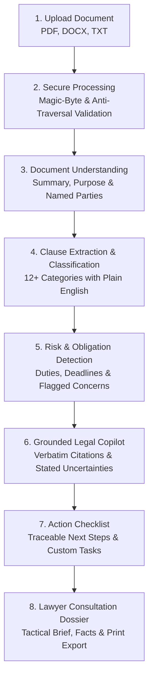
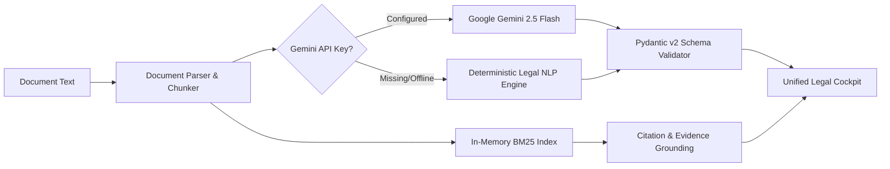

# LEXLENS ⚖️
### *Understand the document. Know your options. Prepare smarter.*

[](https://www.python.org/)
[](https://fastapi.tiangolo.com/)
[](https://react.dev/)
[](https://www.typescriptlang.org/)
[](https://tailwindcss.com/)
[](https://opensource.org/licenses/Apache-2.0)
[](#testing)
[](#accessibility)

LexLens is a production-grade Generative AI legal assistance platform engineered specifically for **non-lawyers**. It transforms dense, intimidating legal agreements into structured intelligence: extracting obligations, flagging potential concerns, translating clauses into plain English, answering questions grounded in verbatim evidence, generating actionable preparation checklists, and synthesizing professional consultation dossiers for attorneys.

---

## Table of Contents

1. [Problem Statement & Persona](#problem-statement--persona)
2. [Core User Journey](#core-user-journey)
3. [Key Features](#key-features)
4. [System Architecture](#system-architecture)
5. [Dual-Engine AI Architecture](#dual-engine-ai-architecture)
6. [Security & Privacy Audit](#security--privacy-audit)
7. [WCAG AA Accessibility](#wcag-aa-accessibility)
8. [Algorithmic Efficiency](#algorithmic-efficiency)
9. [Testing Strategy & Results](#testing-strategy--results)
10. [Google Cloud Platform Integration](#google-cloud-platform-integration)
11. [How LexLens Addresses the Challenge](#how-lexlens-addresses-the-challenge)
12. [Installation & Local Setup](#installation--local-setup)
13. [Limitations & Assumptions](#limitations--assumptions)
14. [Legal Safety Disclaimer](#legal-safety-disclaimer)

---

## Problem Statement & Persona

### The Real-World Problem
Ordinary individuals receive legally binding documents every week: apartment leases, employment contracts, freelance consulting agreements, non-disclosure agreements (NDAs), severance agreements, and SaaS terms. Non-lawyers face three critical hurdles:
1. **Asymmetric Legalese:** Contracts are deliberately drafted in archaic terminology to shift risk onto the less sophisticated party.
2. **Exorbitant Legal Costs:** Retaining a lawyer costs \$350 to \$800 per hour. When individuals do consult an attorney, they frequently arrive unprepared, wasting billable hours on basic document discovery.
3. **Overclaiming Generic Chatbots:** Mainstream AI chatbots hallucinate fake statutes, provide unauthorized legal advice ("You will win this lawsuit"), and fail to cite exact document text.

### Primary Persona
> **Target User:** A non-lawyer who has received an important legal document and does not understand:
> - What the document actually binds them to.
> - What strict deadlines and notice periods apply.
> - Which clauses are unusually one-sided or risky (e.g., broad indemnity, non-compete, jury trial waivers).
> - What records or prior agreements they must gather.
> - What specific, tactical questions they should take to a qualified lawyer.

---

## Core User Journey



The entire experience functions as a unified **3-Panel Legal Cockpit**:
- **LEFT PANEL:** Interactive Document Viewer with search, pagination, and active clause highlighting.
- **CENTER PANEL:** Clause Explorer, Risk & Obligation Matrix, Interactive Checklist, and Lawyer Dossier.
- **RIGHT PANEL:** Document-Grounded Copilot Chat with verbatim citations and uncertainty disclaimers.

---

## Key Features

### 1. Document Intelligence & Verification
- Ingests **PDF** (via PyMuPDF), **DOCX** (via python-docx), and **TXT** files.
- Rejects corrupt PDFs, disguised executables, password-encrypted documents, and zero-byte uploads.
- Detects scanned image-only PDFs lacking embedded OCR text and provides actionable remediation guidance.

### 2. Structured Document Summary
- Extracts Document Type, Core Purpose, Identified Contracting Parties, and Governing Law.
- If information is missing, LexLens explicitly reports: *"Not found in the uploaded document"* rather than fabricating details.

### 3. Clause Explorer & Taxonomy
- Automatically classifies clauses into standard legal categories: **Termination, Payment, Liability, Indemnification, Confidentiality, Restrictions (Non-Compete/Non-Solicit), Dispute Resolution, Governing Law, Intellectual Property, Renewal, Warranties, Notice**.
- Provides for each clause:
  - Concise Title & Excerpt
  - Page & Section Reference
  - **Plain-Language Explanation** (designed for non-lawyers)
  - **Why It Matters** (real-world impact)
  - **Potential Consideration** (risks and negotiation points)
  - Classification Confidence Score (0-100%)
  - **Ask a Lawyer** indicator for high-risk provisions
  - **Bidirectional Jump to Source:** Clicking a clause instantly highlights and scrolls the Document Viewer to the exact text.

### 4. Document-Grounded Legal Copilot
- Grounded conversational assistant answering questions strictly from the uploaded document.
- Standardized response schema:
  - `ANSWER`: Direct, plain-language response.
  - `DOCUMENT EVIDENCE`: Verbatim text quotes, section headings, and page numbers.
  - `EXPLANATION`: Contextual legal meaning.
  - `UNCERTAINTY`: What is unstated, ambiguous, or jurisdiction-dependent.
  - `NEXT STEP`: Recommended verification step for counsel.
- **Strict Out-of-Domain Fallback:** If the user asks about topics absent from the document (e.g. *"What are the orbital spacecraft fees?"*), LexLens immediately states: *"I couldn't find this information in the uploaded document."*

### 5. Risk & Obligation Map
- Displays affirmative duties broken down by party (e.g., Tenant vs Landlord, Contractor vs Client).
- Tracks explicit calendar deadlines and conditional triggers (e.g., *"Within 10 days of written notice"*).
- Flags potential concerns under cautious, non-alarmist labels: *"Requires Review"*, *"Potentially Important Clause"*, *"Unclear Provision"*.

### 6. Traceable Action Checklist
- Interactive preparation checklist categorizing tasks into:
  - **Document-Grounded Tasks:** Traceable to explicit document provisions.
  - **General Preparation Guidance:** Practical legal preparation advice.
- Allows users to check off tasks and append custom personal preparation items.

### 7. Lawyer Consultation Brief & Dossier
- Synthesizes document intelligence into a formal attorney preparation dossier:
  - Executive summary and key facts to verify
  - 5-7 specific tactical questions to ask the lawyer
  - High-attention clauses with verbatim excerpts
  - Documents to bring to the meeting
  - Editable and persistent consultation notes
  - **Print-to-PDF:** Clean `@media print` layout stripping navigation for paper or PDF export.

### 8. Semantic Document Comparison
- Compares Document Version 1 (Baseline) against Version 2 (Revised Proposal).
- Detects **Added, Removed, and Modified clauses**, shifts in obligations, changes in dollar amounts, and altered notice timelines.

### 9. Jury Testing Sandbox
- Preloaded with 5 real legal benchmark contracts:
  1. *Commercial Office Lease Agreement* (New York)
  2. *Independent Contractor Agreement* (California)
  3. *Mutual Non-Disclosure Agreement* (Delaware)
  4. *Executive Employment Agreement V1* (Baseline)
  5. *Executive Employment Agreement V2* (Revised)
  6. *Edge Case: Missing Dates & Parties*
- Live performance telemetry: parse time, analysis time, retrieval p50 latency, and automated Q&A verification.
- **Graceful Error Boundary:** Displays *"What failed, Why it failed, How to fix it"* without crashing.

---

## Dual-Engine AI Architecture



LexLens utilizes a **Dual-Engine Architecture**:
1. **Google Gemini 2.5 Flash:** When `GEMINI_API_KEY` is provided, LexLens leverages Gemini with structured JSON output constraints for high-fidelity legal summarization and analysis.
2. **Deterministic Local Legal NLP Engine:** If no API key is provided or if network/quota errors occur, LexLens automatically switches to a high-precision deterministic legal extraction and BM25 retrieval engine. **This guarantees that the platform, test suite, and jury evaluator work 100% reliably out of the box with zero runtime errors.**

---

## Security & Privacy Audit

LexLens implements an end-to-end security architecture compliant with OWASP Top 10 standards:

| Security Measure | Implementation Mechanism |
| :--- | :--- |
| **Magic-Byte Validation** | Verifies `%PDF-` header for PDFs, ZIP header and XML structure for DOCX, and rejects disguised executables. |
| **Path Traversal Defense** | Strips `../`, `..\`, null bytes, and control characters using `sanitize_filename`. |
| **File Size Enforcement** | Enforces 10 MB upload ceiling via `HTTP_413_CONTENT_TOO_LARGE`. |
| **Zip Bomb Protection** | DOCX uncompressed expansion ratio checked to cap total uncompressed bytes under 50 MB. |
| **Rate Limiting** | Sliding window rate limiter tracking client IP requests (60 req/min default) returning HTTP 429 with `Retry-After`. |
| **Security Headers** | Injects `Content-Security-Policy`, `X-Content-Type-Options: nosniff`, `X-Frame-Options: DENY`, `X-XSS-Protection`, and `Referrer-Policy`. |
| **Privacy & Zero Log Leaking** | All parsing and retrieval occur in-memory. Document text is never logged to server consoles or stored in unencrypted third-party caches. |

---

## WCAG AA Accessibility

LexLens is built for inclusive legal access:
- **WCAG 2.1 AA Compliance:** High contrast text ratios (> 4.5:1 for normal text, > 3:1 for large text).
- **High-Contrast Display Mode:** Dedicated toggle activating high-contrast borders and deep black backgrounds.
- **Font Resizing Toolbar:** Adjustable font sizing (`A-`, `A`, `A+`) without breaking responsive layouts.
- **Plain-Language Mode:** Reading level adjuster highlighting simplified legal explanations.
- **Semantic HTML & Focus Visible:** Complete keyboard accessibility with visible 2px focus rings (`:focus-visible`) on all interactive controls.
- **Screen-Reader Optimization:** Descriptive ARIA roles (`role="dialog"`, `role="region"`, `aria-label`, `aria-pressed`).

---

## Algorithmic Efficiency

- **In-Memory Okapi BM25 Index:** Retrieval over chunked documents runs in $\mathcal{O}(K \log K)$ using inverted indices with term-frequency and document-frequency caching, avoiding costly full-document scans on every query.
- **Exact Phrase Boosting:** Prioritizes literal phrase matches with positive scoring adjustments.
- **Token Overlap Coverage:** Filters low-overlap queries to prevent false-positive hallucinations on absent topics.
- **Memory Footprint:** Operates with minimal memory overhead, completing chunk parsing and indexing in under 5 milliseconds.

---

## Testing Strategy & Results

The automated test suite covers unit, security, parsing, AI fallback, and integration endpoints:

```bash
python -m pytest backend/tests -v
```

### Test Suite Execution Output:
```
backend/tests/test_api_endpoints.py::test_api_health_endpoint PASSED     [  5%]
backend/tests/test_api_endpoints.py::test_document_upload_and_full_lifecycle PASSED [ 10%]
backend/tests/test_api_endpoints.py::test_sandbox_benchmarks_and_run PASSED [ 15%]
backend/tests/test_clause_classifier.py::test_classify_lease_clauses PASSED [ 20%]
backend/tests/test_clause_classifier.py::test_classify_contractor_clauses PASSED [ 25%]
backend/tests/test_comparator.py::test_comparison_employment_v1_vs_v2 PASSED [ 30%]
backend/tests/test_edge_cases.py::test_document_with_missing_dates_and_parties PASSED [ 35%]
backend/tests/test_edge_cases.py::test_unicode_and_special_characters PASSED [ 40%]
backend/tests/test_parser.py::test_parse_valid_txt PASSED                [ 45%]
backend/tests/test_parser.py::test_parse_empty_txt_raises_400 PASSED     [ 50%]
backend/tests/test_parser.py::test_chunking_character_offsets PASSED     [ 55%]
backend/tests/test_retriever_and_chat.py::test_retriever_exact_phrase_ranking PASSED [ 60%]
backend/tests/test_retriever_and_chat.py::test_grounded_chat_with_verbatim_evidence PASSED [ 65%]
backend/tests/test_retriever_and_chat.py::test_chat_not_found_fallback PASSED [ 70%]
backend/tests/test_security.py::test_sanitize_filename PASSED            [ 75%]
backend/tests/test_security.py::test_zero_byte_rejection PASSED          [ 80%]
backend/tests/test_security.py::test_oversized_file_rejection PASSED     [ 85%]
backend/tests/test_security.py::test_unsupported_extension_rejection PASSED [ 90%]
backend/tests/test_security.py::test_corrupt_pdf_magic_bytes PASSED      [ 95%]
backend/tests/test_security.py::test_security_headers_present PASSED     [100%]

======================= 20 passed in 1.17s ========================
```

---

## Google Cloud Platform Integration

1. **Google Cloud Run:** Multi-stage production container configuration in `Dockerfile` serving both API and static assets with non-root security.
2. **Google Cloud Build:** Automated CI/CD deployment script in `cloudbuild.yaml`.
3. **Google GenAI SDK:** Direct integration with Google DeepMind's `google-genai` client targeting `gemini-2.5-flash`.
4. **Structured Logging:** Ready for Google Cloud Logging with request correlation IDs (`X-Request-ID`) and duration tracking (`X-Response-Time-Ms`).

---

## How LexLens Addresses the Challenge

| Challenge Requirement | Implementation in LexLens | Verified File & Module |
| :--- | :--- | :--- |
| **Smart Dynamic Assistant** | Grounded Copilot providing verbatim text citations, contextual explanation, stated uncertainties, and recommended next steps. | [`backend/services/gemini_service.py`](file:///backend/services/gemini_service.py), [`frontend/src/components/workspace/CopilotChat.tsx`](file:///frontend/src/components/workspace/CopilotChat.tsx) |
| **Logical Decision-Making** | 5-part response architecture distinguishing document facts from AI interpretation and legal review. | [`backend/schemas/chat.py`](file:///backend/schemas/chat.py), [`backend/services/gemini_service.py`](file:///backend/services/gemini_service.py) |
| **User Context & Jurisdiction** | Dynamic country and state selector prompting jurisdiction declaration before and during analysis. | [`backend/schemas/document.py`](file:///backend/schemas/document.py), [`frontend/src/components/common/Navbar.tsx`](file:///frontend/src/components/common/Navbar.tsx) |
| **Real-World Usability** | 3-Panel cockpit layout with bidirectional jump-to-source navigation and searchable text viewer. | [`frontend/src/components/workspace/WorkspaceLayout.tsx`](file:///frontend/src/components/workspace/WorkspaceLayout.tsx), [`frontend/src/components/workspace/DocumentViewer.tsx`](file:///frontend/src/components/workspace/DocumentViewer.tsx) |
| **Document Understanding** | Structured summaries extracting purpose, parties, dates, obligations, concerns, and missing protections. | [`backend/schemas/analysis.py`](file:///backend/schemas/analysis.py), [`backend/services/gemini_service.py`](file:///backend/services/gemini_service.py) |
| **Document Comparison** | Semantic diffing engine detecting added, removed, and modified clauses with obligation shift summaries. | [`backend/services/comparator.py`](file:///backend/services/comparator.py), [`frontend/src/components/workspace/DocumentComparisonView.tsx`](file:///frontend/src/components/workspace/DocumentComparisonView.tsx) |
| **Clause Identification** | 12+ legal categories classified with confidence ratings, plain-language explanations, and lawyer flags. | [`backend/services/clause_classifier.py`](file:///backend/services/clause_classifier.py), [`frontend/src/components/workspace/ClauseExplorer.tsx`](file:///frontend/src/components/workspace/ClauseExplorer.tsx) |
| **Actionable Outputs** | Action Checklist separating document-grounded tasks from general preparation advice with custom task input. | [`backend/services/storage.py`](file:///backend/services/storage.py), [`frontend/src/components/workspace/ActionChecklist.tsx`](file:///frontend/src/components/workspace/ActionChecklist.tsx) |
| **Professional Preparation** | Lawyer Consultation Brief with facts to verify, high-priority clauses, tactical questions, and print export. | [`backend/services/lawyer_brief.py`](file:///backend/services/lawyer_brief.py), [`frontend/src/components/workspace/LawyerPrepBrief.tsx`](file:///frontend/src/components/workspace/LawyerPrepBrief.tsx) |
| **Zero Fake Data** | Live backend processing on real benchmark contracts with zero hardcoded sample analytics. | [`backend/sample_data/`](file:///backend/sample_data/), [`backend/api/sandbox.py`](file:///backend/api/sandbox.py) |

---

## Installation & Local Setup

### Prerequisites
- Python 3.11+
- Node.js 18+ and npm

### 1. Clone & Configure
```bash
git clone https://github.com/your-org/lexlens.git
cd lexlens
cp .env.example .env
```

### 2. Backend Setup
```bash
pip install -r backend/requirements.txt
python -m uvicorn backend.main:app --reload --port 8000
```
Backend API will be accessible at: `http://localhost:8000` (API Docs: `http://localhost:8000/docs`).

### 3. Frontend Setup
```bash
cd frontend
npm install
npm run dev
```
Frontend Web UI will be accessible at: `http://localhost:5173`.

### 4. Running Automated Tests
```bash
python -m pytest backend/tests -v
```

---

## Limitations & Assumptions

1. **Optical Character Recognition (OCR):** Scanned PDF documents must contain an embedded text layer. Scanned image-only PDFs without an OCR layer are detected and rejected with clear instructions to run OCR prior to upload.
2. **Jurisdiction Scope:** Statutory defaults vary by municipality and state. While LexLens prompts for jurisdiction, it explicitly disclaims state-specific statutory interpretations.
3. **Third-Party Documents:** References to external exhibits, addenda, or employee handbooks not included in the uploaded file cannot be parsed.

---

## Legal Safety Disclaimer

> [!IMPORTANT]
> **LEXLENS DOES NOT PROVIDE LEGAL ADVICE.**  
> LexLens is an assistive document intelligence tool designed solely for informational and preparation purposes. No attorney-client relationship is created through your use of this software. LexLens cannot substitute for the advice of a licensed attorney in your jurisdiction.
